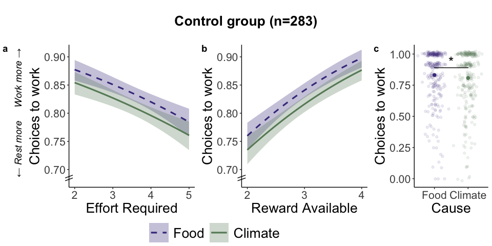
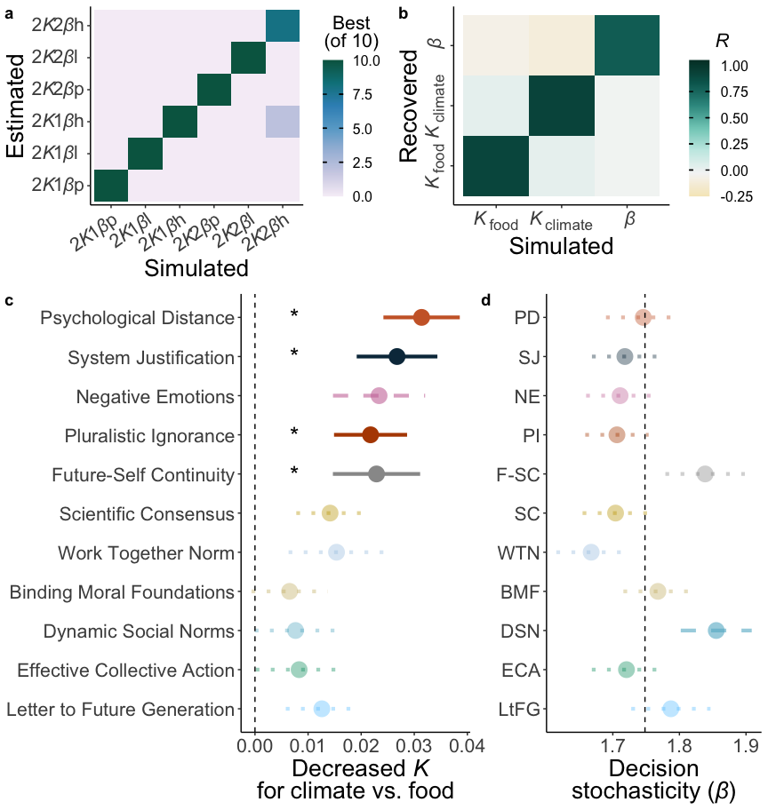

# Methods

## Set up and functions

## Load and organise the survey data

## Load and organise the effort data

## Load and organise the modelling data

## Means & correlations

## Mixed models of choices

## Mixed models of *K*s

## Mixed models of intervention effects on choices

## Mixed models of intervention effects on *K*s

## Mixed models of intervention effects on beta parameters

## Mixed models of intervention effects on WEPT

## Plot of sample

## Plots of choices

## Plots of *K* parameters

## Plots of beta parameters

## Plots of *K* parameters with other measures

## Plots of model identifiability, parameter recovery & model fit

# Results

We tested our preregistered hypotheses in samples from six countries, recruited to be representative on age and gender, creating a large international total 
n=3055 from
Bulgaria
(n=404
age -1.5702-2.0231, 
mean=0.01,
48% female), 
Greece
(n=85: see Methods,
age -1.5037-1.2911, 
mean=-0.3,
48% female), 
Nigeria
(n=660
age -1.5702-1.7569, 
mean=-0.62,
39% female), 
Sweden
(n=1090
age -1.5702-2.1562, 
mean=0.08,
52% female), 
UK
(n=482
age -1.5702-2.1562, 
mean=0.42,
56% female), 
and USA
(n=334
age -1.5037-2.1562, 
mean=0.41,
59% female; 
Figure 1A). Participants were randomly assigned to one of 11 interventions or the control group[REFS] (see Methods & Table S1) and completed the novel Pro-Environmental Effort Task (PEET; Figure 1B). First, participants clicked as many boxes as possible within 10 seconds to evaluate their maximum capability and all subsequent effort levels were tailored to this. Then on each trial, participants chose between a no-effort, low-reward “rest” option and a high-effort high-reward “work” option. On half of the trials, the reward was for an environmental charity that “prevents climate change by reducing carbon emissions”. On the other half, they chose whether to exert effort to benefit a charity that “prevents starvation by providing food”, providing a tightly matched non-climate control. The reward available (3 levels: 4, 12, 20 credits), effort required (4 levels: 50, 65, 80 or 95% of maximum), and cause (climate / food) were manipulated independently, allowing us to assess the impact of each and fit computational models that precisely quantify motivation to help each cause.

## *Environmental benefits are devalued when they require effort*

Our first analysis considered how the level of effort required and the amount of reward available affected decisions to take effortful actions that benefitted the environment or the control food charity. We used generalised linear mixed-effects models (GLMMs) to determine whether choices between working or resting were sensitive to effort and reward. First, we included only participants in the control group, collapsed across all six countries, to quantify effort and reward effects in the absence of any intervention (n=283). As predicted, people were more willing to work when the effort required was lower (GLMM odds ratio (OR) 
95% confidence interval]=1.96
[1.70,
2.27],
*p*<0.001; Figure 2A) and when the benefit was greater
(OR=0.70
[0.58,
0.85],
*p*<0.001; Figure 2B & Table S2).
These significant effects of effort and reward were replicated in the full sample across intervention groups 
(effort OR=0.76
[0.68,
0.84],
*p*<0.001;
reward OR=1.95
[1.66,
2.28],
*p*<0.001) and in each country separately (Figure S1). In other words, people were more willing to take effortful actions to protect the environment and provide food when the positive impact was greater, or the action was easier. These analyses also support that the PEET provides a rapid and robust tool to analyse sensitivity to effort and reward in choices to help the environment.

### Figure 2:

**Figure 2. Effort, reward, and cause determine choices to exert effort for the climate and food charities in the Pro-Environmental Effort Task (PEET) (a)** Participants in the control group (n=283), who did not experience a pro-environmental intervention, were more willing to choose to exert physical effort for rewards when the level of effort required was lower. **(b)** Willingness to work was also higher when the reward available was larger. **(c)** Control participants were more willing to choose work to help the food charity compared to the climate charity. Asterisks between food and climate represent a significant effect (p<0.05) of cause in the GLMM of choices.

## *Psychological interventions increase relative willingness to help the environment*

After establishing that rewards for the climate and the food charity were devalued by the effort required to obtain them, we directly compared choices to work between the two tightly matched charities in the control group. Strikingly, control participants showed a significant bias towards helping the food charity, over the climate charity 
(OR=1.13
[1.02,
1.25],
*p*=0.017; Figure 2C). This bias further emphasises the importance of identifying interventions that can boost pro-environmental motivation. 

Next, we examined how the 11 interventions, developed based on psychological theories specifically to facilitate pro-environmental actions and selected by experts, affected willingness to put in effort to help the climate relative to the food charity. We tested the impact of each intervention compared to the control group using a GLMM (see Methods). To establish results were robust, we also accounted for demographic characteristics that might affect motivation, differing times since starting the study, and motivation to engage in the study. Thus, we ran three control analyses: (i) age and gender, (ii) how much time had elapsed since participants started the study, and (iii) pages completed on the Work for Environmental Protection Task (WEPT; see Methods), an existing decision-making task always completed before the PEET. 

Of 11 interventions, three increased choices to help the climate charity relative to the food charity with effects robust across control analyses: Psychological Distance (PD), System Justification (SJ) and Negative Emotions (NE; GLMM cause\*intervention interactions control vs. PD OR=0.82
[0.71,
0.96],
*p*=0.012; 
control vs. SJ OR=0.86
[0.74,
1.00],
*p*=0.044;
control vs. NE OR=0.85
[0.74,
0.99],
*p*=0.036; Figure 3 & Figure S2). 
A further intervention, Pluralistic Ignorance also significantly increased relative willingness to work for climate vs. food 
(OR=0.86
[0.74,
1.00],
*p*=0.0498) 
but this was not robust to controlling for age & gender 
(OR=0.86
[0.74,
1.00],
*p*=0.0503)
or time in the study 
(OR=0.86
[0.74,
1.00],
*p*=0.056; 
Table S4 for full results and see Supplementary Results & Table S5 for control analyses on WEPT performance in our sample).

### Figure 3

**Figure 3. Positive impact of interventions on willingness to exert effort to help the climate relative to the food charity.** Comparing choices for each intervention against the control group showed robust evidence that Psychological Distance, System Justification, and Negative Emotions interventions significantly increased relative willingness to work for the climate. There was also some evidence to support the effectiveness of the intervention based on Pluralistic Ignorance. Values plotted are the difference between each intervention and the control group (vertical line at zero) in choices to work for the climate – choices to work for the food charity. Significance was tested through cause (climate / food) by intervention (vs. control) interactions in GLMMs. Asterisks and solid lines show interventions with significant interaction effects that are robust across all three control models (for age and gender, time on the survey before the PEET, and pages completed in the WEPT). Dashed lines show interventions with a significant effect in the main model or at least one control model. Dotted lines are interventions that do not significantly interact with the cause (climate / food) in any model.

In summary, we identified several pro-environmental interventions that increased willingness to exert effort to help the climate, relative to willingness to help a non-climate cause. In particular, decreasing psychological distance between the participant and the changing environment, using system justification theory to promote pro-environmental action, and focusing on negative emotions about climate change increased relative willingness to help the environment. 

## Computational models of effort discounting capture motivation to protect the environment

[section in word as refs and no stats]

## Changing pro-environmental motivation with psychological interventions

We extracted the discounting *K* parameters from the best-fitting 2*K*1*\u03B2*-linear model and compared motivation to help the climate with motivation to provide food, first in the control group. Participants had higher discounting parameters for the climate charity than the food charity
(OR=0.97
[0.94,
0.99],
*p*=0.007), demonstrating they devalued donations to the climate charity by the effort required to greater extent. We next examined if any intervention increased relative motivation to help the environment. Four interventions significantly reduced the food over climate bias (Figure 4C) with robust results across control analyses for age and gender, time in the study, and WEPT pages completed (Table S8). Three of these interventions that decreased relative discounting also positively affected choices to work in the model-free analysis: Psychological Distance 
(OR=1.06
[1.03,
1.10],
*p*<0.001)
System Justification 
(OR=1.05
[1.01,
1.08],
*p*=0.008), and
Pluralistic Ignorance 
(OR=1.04
[1.01,
1.08],
*p*=0.022).
In addition, Future Self-Continuity also decreased discounting 
(OR=1.04
[1.00,
1.08],
*p*=0.027; see Table S8 for full results).

Another strength of using computational modelling is that *K* parameters isolate discounting from decision consistency. We therefore evaluated whether interventions also changed decision consistency *\u03B2* parameters. We found no evidence that differences explained any of the significant intervention effects on choices or discounting (Figure 4D & Table S9). Only the Dynamic Social Norms intervention significantly differed from the control group, with greater consistency in choosing the option with higher subjective value following this intervention 
(b=0.13
[0.02,
0.25],
*p*=0.026), but this was not robust across control analyses (Table S9).

In summary, computational modelling revealed specific interventions significantly changed discounting of reward by effort in pro-environmental choices, independent of decision consistency. Interventions targeting Psychological Distance, System Justification and Pluralistic Ignorance robustly decreased relative discounting of climate vs. food compared to the control group, just as they increased relative willingness to choose the work offer. There was also some evidence an intervention promoting a sense of continuity with one’s future self effectively increased relative pro-environmental motivation.

### Figure 4

**Figure 4. Computational modelling reveals interventions increase relative motivation to help the climate. We fit six computational models of effort discounting to the choice data. (a)** Model identifiability analysis shows a strong diagonal across the winning model confusion matrix, meaning the models can be accurately identified and the model comparison process is robust. **(b)** Strong parameter recovery for the best fitting, 2*Κ*1*\u03B2*-linear model is shown by the high correlations on the diagonal between simulated and recovered parameter values and low off-diagonal correlations. **(c)** Comparing discounting (*Κ*) parameters between causes for each intervention relative to the control group identifies four interventions robustly increase motivation (decrease discounting) for the climate vs. food: Psychological Distance, System Justification, Future-Self Continuity and Pluralistic Ignorance. Values plotted are the mean difference between each intervention and the control group (vertical line at zero) in motivation for the climate – motivation for the food charity. **(d)** In contrast, comparing decision noise (*\u03B2*) for each intervention to the control group, only the Dynamic Social Norms intervention showed any evidence of an intervention effect, and this was not robust across control analyses. Values are the mean *\u03B2* parameter in each condition with the mean for the control group shown with a vertical line. Asterisks and solid lines show interventions with significant effects (GLMM cause\*intervention for *Κ*, LMM intervention main effect for *\u03B2*) robust across all three control models (age and gender, time on the survey before the PEET, and WEPT pages completed). Dashed lines are interventions with a significant effect in at least one model (main or control). Dotted lines are interventions with no significant effects.

## *Motivation to take action for the climate is specifically associated with pro-environmental attitudes and beliefs*

An additional advantage of computational modelling is that the separate discounting K parameters precisely estimate motivation to exert effort to obtain rewards for each cause for each participant. This integrated measure can be used to examine how such motivation is related to individual difference in independent measures. In our final analyses, we combined data across interventions and tested whether motivation for effortful actions to help the environment (*Κ*climate) was associated with (i) climate-relevant measures of belief in human-made climate change and support for policies that protect the planet and (ii) general measures of trait apathy and current fatigue (see Methods). We also examined the same correlations for motivation to help the food charity (*Κ*food) to test the specificity of associations. 

Motivation to exert effort for the climate was positively associated with belief in climate change (negative correlation with *Κ*s 
*r*(3055)=-0.20
[-0.23,
-0.16],
*p*<0.001)
and support for pro-environmental policies 
(*r*(3037)=-0.19
[-0.22,
-0.15]
*p*<0.001). 
Importantly, these associations between climate-relevant measures and pro-environmental motivation were significantly stronger than the corresponding correlations with motivation to help the food cause 
(belief *r*(3055)=-0.09
[-0.12,
-0.05],
*p*<0.001; 
difference
Z=4.33,
*p*<0.001; Figure 5A;
policy support
*r*(3037)=-0.09
[-0.12,
-0.05],
*p*<0.001;
difference
Z=3.85,
*p*<0.001; Figure 5B).
In contrast, broader measures of trait apathy and how subjectively effortful participants found the highest effort level, showed significant negative associations for both climate motivation and food motivation, with no significant difference between causes 
(*Κ*climate & apathy *r*(2597)=0.10
[0.06,
0.14],
*p*<0.001; 
*Κ*food & apathy *r*(2597)=0.09
[0.05,
0.13],
*p*<0.001; 
difference Z=0.31,
*p*=0.76; Figure 5C;
*Κ*climate & subjective effort *r*(2969)=0.13
[0.09,
0.16],
*p*<0.001; 
*Κ*food & apathy *r*(2969)=0.14
[0.11,
0.18],
*p*<0.001; difference Z=0.55,
*p*=0.58; Figure 5D).
Finally, we examined associations between pages completed in the WEPT and motivation to help each cause. WEPT performance was positively correlated with motivation for both the climate 
(*r*(3055)=-0.16
[-0.20,
-0.13],
*p*<0.001
and food 
(*r*(3055)=-0.18
[-0.21,
-0.14],
*p*<0.001) 
charities, but importantly with no significant difference in the strength of these correlations 
(Z=0.54,
*p*=0.59; Figure 5E). 
Together these results highlight the specificity of variability in motivation to help the climate driving individual differences in climate-relevant outcomes, but also that general motivation is an important factor in increasing willingness to exert effort for any cause.

### Figure 5

**Figure 5. Individual differences in pro-environmental motivation are specifically associated with climate beliefs and policy support.** Motivation to help the climate, captured in participants’ discounting *K* parameters, was associated with **(a)** beliefs that climate-change is humman-made 
(*r*(3055)=-0.20
[-0.23,
-0.16],
*p*<0.001)
and **(b)** support for policies that protect the environment 
(*r*(3037)=-0.19
[-0.22,
-0.15]
*p*<0.001).
These associations between pro-environmental motivation (*K*climate) and climate-relevant measures were significantly stronger than the corresponding association for motivation for the food charity (*K*food; belief difference 
Z=4.33,
*p*<0.001; policy support difference 
Z=3.85,
*p*<0.001). 
Considering measures of general motivation, both **(c)** trait apathy and **(d)** self-reported ratings of subjective effort were negatively associated with motivation for both the climate and food charity, with no significant differences between these correlations 
(*Κ*climate & apathy *r*(2597)=0.10
[0.06,
0.14],
*p*<0.001; 
*Κ*food & apathy *r*(2597)=0.09
[0.05,
0.13],
*p*<0.001; 
difference Z=0.31,
*p*=0.76; 
*Κ*climate & subjective effort *r*(2969)=0.13
[0.09,
0.16],
*p*<0.001; 
*Κ*food & apathy *r*(2969)=0.14
[0.11,
0.18],
*p*<0.001; difference Z=0.55,
*p*=0.58).
**(e)** the number of pages completed on the Work for Environmental Protection Task (WEPT) also positively correlated with motivation (lower *K*) to help both causes (climate (*r*(3055)=-0.16
[-0.20,
-0.13],
*p*<0.001; food 
*r*(3055)=-0.18
[-0.21,
-0.14],
*p*<0.001)
with no significant difference between these correlations
(Z=0.54,
*p*=0.59).

# Supplement

**Figure S1.**

**Figure S2.**

**Table S2.**
<table class="table" style="margin-left: auto; margin-right: auto;">
<caption>GLMM of choices in control group</caption>
 <thead>
  <tr>
   <th style="text-align:left;"> Parameter </th>
   <th style="text-align:center;"> Coefficient </th>
   <th style="text-align:center;"> SE </th>
   <th style="text-align:center;"> CI_low </th>
   <th style="text-align:center;"> CI_high </th>
   <th style="text-align:center;"> z </th>
   <th style="text-align:center;"> p </th>
  </tr>
 </thead>
<tbody>
  <tr>
   <td style="text-align:left;"> (Intercept) </td>
   <td style="text-align:center;"> 16.40 </td>
   <td style="text-align:center;"> 2.53 </td>
   <td style="text-align:center;"> 12.12 </td>
   <td style="text-align:center;"> 22.19 </td>
   <td style="text-align:center;"> 18.13 </td>
   <td style="text-align:center;"> &lt;0.001 </td>
  </tr>
  <tr>
   <td style="text-align:left;"> Effort </td>
   <td style="text-align:center;"> 0.70 </td>
   <td style="text-align:center;"> 0.07 </td>
   <td style="text-align:center;"> 0.58 </td>
   <td style="text-align:center;"> 0.85 </td>
   <td style="text-align:center;"> -3.63 </td>
   <td style="text-align:center;"> &lt;0.001 </td>
  </tr>
  <tr>
   <td style="text-align:left;"> Reward </td>
   <td style="text-align:center;"> 1.96 </td>
   <td style="text-align:center;"> 0.15 </td>
   <td style="text-align:center;"> 1.70 </td>
   <td style="text-align:center;"> 2.27 </td>
   <td style="text-align:center;"> 9.12 </td>
   <td style="text-align:center;"> &lt;0.001 </td>
  </tr>
  <tr>
   <td style="text-align:left;"> Cause (Food &gt; Climate) </td>
   <td style="text-align:center;"> 1.13 </td>
   <td style="text-align:center;"> 0.06 </td>
   <td style="text-align:center;"> 1.02 </td>
   <td style="text-align:center;"> 1.25 </td>
   <td style="text-align:center;"> 2.38 </td>
   <td style="text-align:center;"> 0.017 </td>
  </tr>
</tbody>
</table>

**Table S3.**
<table class="table" style="margin-left: auto; margin-right: auto;">
<caption>GLMM of choices in full sample</caption>
 <thead>
  <tr>
   <th style="text-align:left;"> Parameter </th>
   <th style="text-align:center;"> Coefficient </th>
   <th style="text-align:center;"> SE </th>
   <th style="text-align:center;"> CI_low </th>
   <th style="text-align:center;"> CI_high </th>
   <th style="text-align:center;"> z </th>
   <th style="text-align:center;"> p </th>
  </tr>
 </thead>
<tbody>
  <tr>
   <td style="text-align:left;"> (Intercept) </td>
   <td style="text-align:center;"> 16.34 </td>
   <td style="text-align:center;"> 0.82 </td>
   <td style="text-align:center;"> 14.81 </td>
   <td style="text-align:center;"> 18.03 </td>
   <td style="text-align:center;"> 55.56 </td>
   <td style="text-align:center;"> &lt;0.001 </td>
  </tr>
  <tr>
   <td style="text-align:left;"> Effort </td>
   <td style="text-align:center;"> 0.76 </td>
   <td style="text-align:center;"> 0.04 </td>
   <td style="text-align:center;"> 0.68 </td>
   <td style="text-align:center;"> 0.84 </td>
   <td style="text-align:center;"> -5.12 </td>
   <td style="text-align:center;"> &lt;0.001 </td>
  </tr>
  <tr>
   <td style="text-align:left;"> Reward </td>
   <td style="text-align:center;"> 1.95 </td>
   <td style="text-align:center;"> 0.16 </td>
   <td style="text-align:center;"> 1.66 </td>
   <td style="text-align:center;"> 2.28 </td>
   <td style="text-align:center;"> 8.18 </td>
   <td style="text-align:center;"> &lt;0.001 </td>
  </tr>
  <tr>
   <td style="text-align:left;"> Cause (Food &gt; Climate) </td>
   <td style="text-align:center;"> 1.03 </td>
   <td style="text-align:center;"> 0.02 </td>
   <td style="text-align:center;"> 0.99 </td>
   <td style="text-align:center;"> 1.06 </td>
   <td style="text-align:center;"> 1.54 </td>
   <td style="text-align:center;"> 0.12 </td>
  </tr>
</tbody>
</table>

**Table S4.**
<table class="table" style="margin-left: auto; margin-right: auto;">
<caption>GLMM of choices in full sample - interventions</caption>
 <thead>
  <tr>
   <th style="text-align:left;"> Parameter </th>
   <th style="text-align:center;"> Coefficient </th>
   <th style="text-align:center;"> SE </th>
   <th style="text-align:center;"> CI_low </th>
   <th style="text-align:center;"> CI_high </th>
   <th style="text-align:center;"> z </th>
   <th style="text-align:center;"> p </th>
   <th style="text-align:center;"> agegen_p </th>
   <th style="text-align:center;"> t1_p </th>
   <th style="text-align:center;"> wept_p </th>
  </tr>
 </thead>
<tbody>
  <tr>
   <td style="text-align:left;"> (Intercept) </td>
   <td style="text-align:center;"> 17.73 </td>
   <td style="text-align:center;"> 2.63 </td>
   <td style="text-align:center;"> 13.26 </td>
   <td style="text-align:center;"> 23.71 </td>
   <td style="text-align:center;"> 19.39 </td>
   <td style="text-align:center;"> &lt;0.001 </td>
   <td style="text-align:center;"> &lt;0.001 </td>
   <td style="text-align:center;"> &lt;0.001 </td>
   <td style="text-align:center;"> &lt;0.001 </td>
  </tr>
  <tr>
   <td style="text-align:left;"> Effort </td>
   <td style="text-align:center;"> 0.76 </td>
   <td style="text-align:center;"> 0.04 </td>
   <td style="text-align:center;"> 0.68 </td>
   <td style="text-align:center;"> 0.84 </td>
   <td style="text-align:center;"> -5.12 </td>
   <td style="text-align:center;"> &lt;0.001 </td>
   <td style="text-align:center;"> &lt;0.001 </td>
   <td style="text-align:center;"> &lt;0.001 </td>
   <td style="text-align:center;"> &lt;0.001 </td>
  </tr>
  <tr>
   <td style="text-align:left;"> Reward </td>
   <td style="text-align:center;"> 1.95 </td>
   <td style="text-align:center;"> 0.16 </td>
   <td style="text-align:center;"> 1.66 </td>
   <td style="text-align:center;"> 2.28 </td>
   <td style="text-align:center;"> 8.17 </td>
   <td style="text-align:center;"> &lt;0.001 </td>
   <td style="text-align:center;"> &lt;0.001 </td>
   <td style="text-align:center;"> &lt;0.001 </td>
   <td style="text-align:center;"> &lt;0.001 </td>
  </tr>
  <tr>
   <td style="text-align:left;"> Cause (Food &gt; Climate) </td>
   <td style="text-align:center;"> 1.13 </td>
   <td style="text-align:center;"> 0.06 </td>
   <td style="text-align:center;"> 1.02 </td>
   <td style="text-align:center;"> 1.26 </td>
   <td style="text-align:center;"> 2.36 </td>
   <td style="text-align:center;"> 0.018 </td>
   <td style="text-align:center;"> 0.018 </td>
   <td style="text-align:center;"> 0.022 </td>
   <td style="text-align:center;"> 0.018 </td>
  </tr>
  <tr>
   <td style="text-align:left;"> Work Together Norm </td>
   <td style="text-align:center;"> 0.76 </td>
   <td style="text-align:center;"> 0.16 </td>
   <td style="text-align:center;"> 0.50 </td>
   <td style="text-align:center;"> 1.16 </td>
   <td style="text-align:center;"> -1.26 </td>
   <td style="text-align:center;"> 0.21 </td>
   <td style="text-align:center;"> 0.24 </td>
   <td style="text-align:center;"> 0.25 </td>
   <td style="text-align:center;"> 0.27 </td>
  </tr>
  <tr>
   <td style="text-align:left;"> Negative Emotions </td>
   <td style="text-align:center;"> 0.74 </td>
   <td style="text-align:center;"> 0.16 </td>
   <td style="text-align:center;"> 0.49 </td>
   <td style="text-align:center;"> 1.13 </td>
   <td style="text-align:center;"> -1.40 </td>
   <td style="text-align:center;"> 0.16 </td>
   <td style="text-align:center;"> 0.14 </td>
   <td style="text-align:center;"> 0.19 </td>
   <td style="text-align:center;"> 0.11 </td>
  </tr>
  <tr>
   <td style="text-align:left;"> Scientific Consensus </td>
   <td style="text-align:center;"> 1.01 </td>
   <td style="text-align:center;"> 0.21 </td>
   <td style="text-align:center;"> 0.67 </td>
   <td style="text-align:center;"> 1.52 </td>
   <td style="text-align:center;"> 0.05 </td>
   <td style="text-align:center;"> 0.96 </td>
   <td style="text-align:center;"> 0.77 </td>
   <td style="text-align:center;"> 0.84 </td>
   <td style="text-align:center;"> 0.72 </td>
  </tr>
  <tr>
   <td style="text-align:left;"> Effective Collective Action </td>
   <td style="text-align:center;"> 0.81 </td>
   <td style="text-align:center;"> 0.17 </td>
   <td style="text-align:center;"> 0.54 </td>
   <td style="text-align:center;"> 1.23 </td>
   <td style="text-align:center;"> -0.98 </td>
   <td style="text-align:center;"> 0.33 </td>
   <td style="text-align:center;"> 0.36 </td>
   <td style="text-align:center;"> 0.33 </td>
   <td style="text-align:center;"> 0.13 </td>
  </tr>
  <tr>
   <td style="text-align:left;"> System Justification </td>
   <td style="text-align:center;"> 0.77 </td>
   <td style="text-align:center;"> 0.16 </td>
   <td style="text-align:center;"> 0.51 </td>
   <td style="text-align:center;"> 1.16 </td>
   <td style="text-align:center;"> -1.25 </td>
   <td style="text-align:center;"> 0.21 </td>
   <td style="text-align:center;"> 0.23 </td>
   <td style="text-align:center;"> 0.32 </td>
   <td style="text-align:center;"> 0.18 </td>
  </tr>
  <tr>
   <td style="text-align:left;"> Psychological Distance </td>
   <td style="text-align:center;"> 0.77 </td>
   <td style="text-align:center;"> 0.16 </td>
   <td style="text-align:center;"> 0.50 </td>
   <td style="text-align:center;"> 1.17 </td>
   <td style="text-align:center;"> -1.24 </td>
   <td style="text-align:center;"> 0.22 </td>
   <td style="text-align:center;"> 0.20 </td>
   <td style="text-align:center;"> 0.19 </td>
   <td style="text-align:center;"> 0.13 </td>
  </tr>
  <tr>
   <td style="text-align:left;"> Pluralistic Ignorance </td>
   <td style="text-align:center;"> 0.99 </td>
   <td style="text-align:center;"> 0.21 </td>
   <td style="text-align:center;"> 0.66 </td>
   <td style="text-align:center;"> 1.50 </td>
   <td style="text-align:center;"> -0.04 </td>
   <td style="text-align:center;"> 0.97 </td>
   <td style="text-align:center;"> 0.99 </td>
   <td style="text-align:center;"> 0.95 </td>
   <td style="text-align:center;"> 0.63 </td>
  </tr>
  <tr>
   <td style="text-align:left;"> Letter to Future Generation </td>
   <td style="text-align:center;"> 0.97 </td>
   <td style="text-align:center;"> 0.22 </td>
   <td style="text-align:center;"> 0.62 </td>
   <td style="text-align:center;"> 1.52 </td>
   <td style="text-align:center;"> -0.13 </td>
   <td style="text-align:center;"> 0.90 </td>
   <td style="text-align:center;"> 0.94 </td>
   <td style="text-align:center;"> 0.70 </td>
   <td style="text-align:center;"> 0.89 </td>
  </tr>
  <tr>
   <td style="text-align:left;"> Dynamic Social Norms </td>
   <td style="text-align:center;"> 1.28 </td>
   <td style="text-align:center;"> 0.27 </td>
   <td style="text-align:center;"> 0.84 </td>
   <td style="text-align:center;"> 1.94 </td>
   <td style="text-align:center;"> 1.16 </td>
   <td style="text-align:center;"> 0.25 </td>
   <td style="text-align:center;"> 0.26 </td>
   <td style="text-align:center;"> 0.22 </td>
   <td style="text-align:center;"> 0.47 </td>
  </tr>
  <tr>
   <td style="text-align:left;"> Future-Self Continuity </td>
   <td style="text-align:center;"> 1.22 </td>
   <td style="text-align:center;"> 0.28 </td>
   <td style="text-align:center;"> 0.78 </td>
   <td style="text-align:center;"> 1.91 </td>
   <td style="text-align:center;"> 0.88 </td>
   <td style="text-align:center;"> 0.38 </td>
   <td style="text-align:center;"> 0.42 </td>
   <td style="text-align:center;"> 0.38 </td>
   <td style="text-align:center;"> 0.58 </td>
  </tr>
  <tr>
   <td style="text-align:left;"> Binding Moral Foundations </td>
   <td style="text-align:center;"> 0.94 </td>
   <td style="text-align:center;"> 0.20 </td>
   <td style="text-align:center;"> 0.62 </td>
   <td style="text-align:center;"> 1.43 </td>
   <td style="text-align:center;"> -0.27 </td>
   <td style="text-align:center;"> 0.79 </td>
   <td style="text-align:center;"> 0.83 </td>
   <td style="text-align:center;"> 0.92 </td>
   <td style="text-align:center;"> 0.44 </td>
  </tr>
  <tr>
   <td style="text-align:left;"> Cause (Food &gt; Climate) * Work Together Norm </td>
   <td style="text-align:center;"> 0.92 </td>
   <td style="text-align:center;"> 0.07 </td>
   <td style="text-align:center;"> 0.79 </td>
   <td style="text-align:center;"> 1.07 </td>
   <td style="text-align:center;"> -1.10 </td>
   <td style="text-align:center;"> 0.27 </td>
   <td style="text-align:center;"> 0.29 </td>
   <td style="text-align:center;"> 0.33 </td>
   <td style="text-align:center;"> 0.27 </td>
  </tr>
  <tr>
   <td style="text-align:left;"> Cause (Food &gt; Climate) * Negative Emotions </td>
   <td style="text-align:center;"> 0.85 </td>
   <td style="text-align:center;"> 0.06 </td>
   <td style="text-align:center;"> 0.74 </td>
   <td style="text-align:center;"> 0.99 </td>
   <td style="text-align:center;"> -2.10 </td>
   <td style="text-align:center;"> 0.036 </td>
   <td style="text-align:center;"> 0.036 </td>
   <td style="text-align:center;"> 0.0493 </td>
   <td style="text-align:center;"> 0.036 </td>
  </tr>
  <tr>
   <td style="text-align:left;"> Cause (Food &gt; Climate) * Scientific Consensus </td>
   <td style="text-align:center;"> 0.92 </td>
   <td style="text-align:center;"> 0.07 </td>
   <td style="text-align:center;"> 0.79 </td>
   <td style="text-align:center;"> 1.06 </td>
   <td style="text-align:center;"> -1.17 </td>
   <td style="text-align:center;"> 0.24 </td>
   <td style="text-align:center;"> 0.22 </td>
   <td style="text-align:center;"> 0.26 </td>
   <td style="text-align:center;"> 0.24 </td>
  </tr>
  <tr>
   <td style="text-align:left;"> Cause (Food &gt; Climate) * Effective Collective Action </td>
   <td style="text-align:center;"> 0.93 </td>
   <td style="text-align:center;"> 0.07 </td>
   <td style="text-align:center;"> 0.80 </td>
   <td style="text-align:center;"> 1.07 </td>
   <td style="text-align:center;"> -1.02 </td>
   <td style="text-align:center;"> 0.31 </td>
   <td style="text-align:center;"> 0.32 </td>
   <td style="text-align:center;"> 0.36 </td>
   <td style="text-align:center;"> 0.31 </td>
  </tr>
  <tr>
   <td style="text-align:left;"> Cause (Food &gt; Climate) * System Justification </td>
   <td style="text-align:center;"> 0.86 </td>
   <td style="text-align:center;"> 0.06 </td>
   <td style="text-align:center;"> 0.74 </td>
   <td style="text-align:center;"> 1.00 </td>
   <td style="text-align:center;"> -2.01 </td>
   <td style="text-align:center;"> 0.044 </td>
   <td style="text-align:center;"> 0.0498 </td>
   <td style="text-align:center;"> 0.0496 </td>
   <td style="text-align:center;"> 0.043 </td>
  </tr>
  <tr>
   <td style="text-align:left;"> Cause (Food &gt; Climate) * Psychological Distance </td>
   <td style="text-align:center;"> 0.82 </td>
   <td style="text-align:center;"> 0.06 </td>
   <td style="text-align:center;"> 0.71 </td>
   <td style="text-align:center;"> 0.96 </td>
   <td style="text-align:center;"> -2.51 </td>
   <td style="text-align:center;"> 0.012 </td>
   <td style="text-align:center;"> 0.012 </td>
   <td style="text-align:center;"> 0.014 </td>
   <td style="text-align:center;"> 0.012 </td>
  </tr>
  <tr>
   <td style="text-align:left;"> Cause (Food &gt; Climate) * Pluralistic Ignorance </td>
   <td style="text-align:center;"> 0.86 </td>
   <td style="text-align:center;"> 0.07 </td>
   <td style="text-align:center;"> 0.74 </td>
   <td style="text-align:center;"> 1.00 </td>
   <td style="text-align:center;"> -1.96 </td>
   <td style="text-align:center;"> 0.0498 </td>
   <td style="text-align:center;"> 0.0503 </td>
   <td style="text-align:center;"> 0.056 </td>
   <td style="text-align:center;"> 0.049 </td>
  </tr>
  <tr>
   <td style="text-align:left;"> Cause (Food &gt; Climate) * Letter to Future Generation </td>
   <td style="text-align:center;"> 1.02 </td>
   <td style="text-align:center;"> 0.08 </td>
   <td style="text-align:center;"> 0.86 </td>
   <td style="text-align:center;"> 1.19 </td>
   <td style="text-align:center;"> 0.18 </td>
   <td style="text-align:center;"> 0.86 </td>
   <td style="text-align:center;"> 0.77 </td>
   <td style="text-align:center;"> 0.82 </td>
   <td style="text-align:center;"> 0.85 </td>
  </tr>
  <tr>
   <td style="text-align:left;"> Cause (Food &gt; Climate) * Dynamic Social Norms </td>
   <td style="text-align:center;"> 0.93 </td>
   <td style="text-align:center;"> 0.07 </td>
   <td style="text-align:center;"> 0.80 </td>
   <td style="text-align:center;"> 1.08 </td>
   <td style="text-align:center;"> -0.95 </td>
   <td style="text-align:center;"> 0.34 </td>
   <td style="text-align:center;"> 0.35 </td>
   <td style="text-align:center;"> 0.39 </td>
   <td style="text-align:center;"> 0.34 </td>
  </tr>
  <tr>
   <td style="text-align:left;"> Cause (Food &gt; Climate) * Future-Self Continuity </td>
   <td style="text-align:center;"> 0.85 </td>
   <td style="text-align:center;"> 0.07 </td>
   <td style="text-align:center;"> 0.72 </td>
   <td style="text-align:center;"> 1.00 </td>
   <td style="text-align:center;"> -1.92 </td>
   <td style="text-align:center;"> 0.055 </td>
   <td style="text-align:center;"> 0.054 </td>
   <td style="text-align:center;"> 0.048 </td>
   <td style="text-align:center;"> 0.054 </td>
  </tr>
  <tr>
   <td style="text-align:left;"> Cause (Food &gt; Climate) * Binding Moral Foundations </td>
   <td style="text-align:center;"> 0.92 </td>
   <td style="text-align:center;"> 0.07 </td>
   <td style="text-align:center;"> 0.79 </td>
   <td style="text-align:center;"> 1.07 </td>
   <td style="text-align:center;"> -1.02 </td>
   <td style="text-align:center;"> 0.31 </td>
   <td style="text-align:center;"> 0.33 </td>
   <td style="text-align:center;"> 0.35 </td>
   <td style="text-align:center;"> 0.31 </td>
  </tr>
</tbody>
</table>

**Table S5.**
<table class="table" style="margin-left: auto; margin-right: auto;">
<caption>CLMM of WEPT in sample with and without PEET exclusions</caption>
 <thead>
  <tr>
   <th style="text-align:left;"> Parameter </th>
   <th style="text-align:center;"> Coefficient </th>
   <th style="text-align:center;"> SE </th>
   <th style="text-align:center;"> CI_low </th>
   <th style="text-align:center;"> CI_high </th>
   <th style="text-align:center;"> z </th>
   <th style="text-align:center;"> p </th>
   <th style="text-align:center;"> Coefficient_exc </th>
   <th style="text-align:center;"> SE_exc </th>
   <th style="text-align:center;"> CI_low_exc </th>
   <th style="text-align:center;"> CI_high_exc </th>
   <th style="text-align:center;"> z_exc </th>
   <th style="text-align:center;"> p_exc </th>
  </tr>
 </thead>
<tbody>
  <tr>
   <td style="text-align:left;"> Work Together Norm </td>
   <td style="text-align:center;"> 0.78 </td>
   <td style="text-align:center;"> 0.06 </td>
   <td style="text-align:center;"> 0.67 </td>
   <td style="text-align:center;"> 0.90 </td>
   <td style="text-align:center;"> -3.44 </td>
   <td style="text-align:center;"> &lt;0.001 </td>
   <td style="text-align:center;"> 0.92 </td>
   <td style="text-align:center;"> 0.13 </td>
   <td style="text-align:center;"> 0.70 </td>
   <td style="text-align:center;"> 1.22 </td>
   <td style="text-align:center;"> -0.57 </td>
   <td style="text-align:center;"> 0.57 </td>
  </tr>
  <tr>
   <td style="text-align:left;"> Negative Emotions </td>
   <td style="text-align:center;"> 0.79 </td>
   <td style="text-align:center;"> 0.06 </td>
   <td style="text-align:center;"> 0.68 </td>
   <td style="text-align:center;"> 0.91 </td>
   <td style="text-align:center;"> -3.21 </td>
   <td style="text-align:center;"> 0.001 </td>
   <td style="text-align:center;"> 1.24 </td>
   <td style="text-align:center;"> 0.18 </td>
   <td style="text-align:center;"> 0.94 </td>
   <td style="text-align:center;"> 1.64 </td>
   <td style="text-align:center;"> 1.51 </td>
   <td style="text-align:center;"> 0.13 </td>
  </tr>
  <tr>
   <td style="text-align:left;"> Scientific Consensus </td>
   <td style="text-align:center;"> 1.02 </td>
   <td style="text-align:center;"> 0.08 </td>
   <td style="text-align:center;"> 0.88 </td>
   <td style="text-align:center;"> 1.18 </td>
   <td style="text-align:center;"> 0.27 </td>
   <td style="text-align:center;"> 0.79 </td>
   <td style="text-align:center;"> 1.44 </td>
   <td style="text-align:center;"> 0.20 </td>
   <td style="text-align:center;"> 1.09 </td>
   <td style="text-align:center;"> 1.90 </td>
   <td style="text-align:center;"> 2.59 </td>
   <td style="text-align:center;"> 0.010 </td>
  </tr>
  <tr>
   <td style="text-align:left;"> Effective Collective Action </td>
   <td style="text-align:center;"> 0.87 </td>
   <td style="text-align:center;"> 0.06 </td>
   <td style="text-align:center;"> 0.75 </td>
   <td style="text-align:center;"> 1.01 </td>
   <td style="text-align:center;"> -1.85 </td>
   <td style="text-align:center;"> 0.064 </td>
   <td style="text-align:center;"> 1.51 </td>
   <td style="text-align:center;"> 0.22 </td>
   <td style="text-align:center;"> 1.14 </td>
   <td style="text-align:center;"> 2.00 </td>
   <td style="text-align:center;"> 2.90 </td>
   <td style="text-align:center;"> 0.004 </td>
  </tr>
  <tr>
   <td style="text-align:left;"> System Justification </td>
   <td style="text-align:center;"> 0.96 </td>
   <td style="text-align:center;"> 0.07 </td>
   <td style="text-align:center;"> 0.83 </td>
   <td style="text-align:center;"> 1.11 </td>
   <td style="text-align:center;"> -0.60 </td>
   <td style="text-align:center;"> 0.55 </td>
   <td style="text-align:center;"> 1.07 </td>
   <td style="text-align:center;"> 0.15 </td>
   <td style="text-align:center;"> 0.81 </td>
   <td style="text-align:center;"> 1.39 </td>
   <td style="text-align:center;"> 0.46 </td>
   <td style="text-align:center;"> 0.64 </td>
  </tr>
  <tr>
   <td style="text-align:left;"> Psychological Distance </td>
   <td style="text-align:center;"> 0.80 </td>
   <td style="text-align:center;"> 0.06 </td>
   <td style="text-align:center;"> 0.69 </td>
   <td style="text-align:center;"> 0.93 </td>
   <td style="text-align:center;"> -2.93 </td>
   <td style="text-align:center;"> 0.003 </td>
   <td style="text-align:center;"> 1.31 </td>
   <td style="text-align:center;"> 0.19 </td>
   <td style="text-align:center;"> 0.99 </td>
   <td style="text-align:center;"> 1.75 </td>
   <td style="text-align:center;"> 1.88 </td>
   <td style="text-align:center;"> 0.060 </td>
  </tr>
  <tr>
   <td style="text-align:left;"> Pluralistic Ignorance </td>
   <td style="text-align:center;"> 0.97 </td>
   <td style="text-align:center;"> 0.07 </td>
   <td style="text-align:center;"> 0.84 </td>
   <td style="text-align:center;"> 1.13 </td>
   <td style="text-align:center;"> -0.36 </td>
   <td style="text-align:center;"> 0.72 </td>
   <td style="text-align:center;"> 1.51 </td>
   <td style="text-align:center;"> 0.22 </td>
   <td style="text-align:center;"> 1.14 </td>
   <td style="text-align:center;"> 2.00 </td>
   <td style="text-align:center;"> 2.86 </td>
   <td style="text-align:center;"> 0.004 </td>
  </tr>
  <tr>
   <td style="text-align:left;"> Letter to Future Generation </td>
   <td style="text-align:center;"> 0.82 </td>
   <td style="text-align:center;"> 0.06 </td>
   <td style="text-align:center;"> 0.70 </td>
   <td style="text-align:center;"> 0.95 </td>
   <td style="text-align:center;"> -2.54 </td>
   <td style="text-align:center;"> 0.011 </td>
   <td style="text-align:center;"> 1.03 </td>
   <td style="text-align:center;"> 0.15 </td>
   <td style="text-align:center;"> 0.77 </td>
   <td style="text-align:center;"> 1.37 </td>
   <td style="text-align:center;"> 0.19 </td>
   <td style="text-align:center;"> 0.85 </td>
  </tr>
  <tr>
   <td style="text-align:left;"> Dynamic Social Norms </td>
   <td style="text-align:center;"> 1.09 </td>
   <td style="text-align:center;"> 0.08 </td>
   <td style="text-align:center;"> 0.94 </td>
   <td style="text-align:center;"> 1.26 </td>
   <td style="text-align:center;"> 1.16 </td>
   <td style="text-align:center;"> 0.25 </td>
   <td style="text-align:center;"> 1.41 </td>
   <td style="text-align:center;"> 0.20 </td>
   <td style="text-align:center;"> 1.07 </td>
   <td style="text-align:center;"> 1.87 </td>
   <td style="text-align:center;"> 2.44 </td>
   <td style="text-align:center;"> 0.015 </td>
  </tr>
  <tr>
   <td style="text-align:left;"> Future-Self Continuity </td>
   <td style="text-align:center;"> 0.92 </td>
   <td style="text-align:center;"> 0.07 </td>
   <td style="text-align:center;"> 0.79 </td>
   <td style="text-align:center;"> 1.08 </td>
   <td style="text-align:center;"> -1.00 </td>
   <td style="text-align:center;"> 0.32 </td>
   <td style="text-align:center;"> 1.32 </td>
   <td style="text-align:center;"> 0.20 </td>
   <td style="text-align:center;"> 0.98 </td>
   <td style="text-align:center;"> 1.77 </td>
   <td style="text-align:center;"> 1.80 </td>
   <td style="text-align:center;"> 0.072 </td>
  </tr>
  <tr>
   <td style="text-align:left;"> Binding Moral Foundations </td>
   <td style="text-align:center;"> 1.14 </td>
   <td style="text-align:center;"> 0.09 </td>
   <td style="text-align:center;"> 0.98 </td>
   <td style="text-align:center;"> 1.32 </td>
   <td style="text-align:center;"> 1.71 </td>
   <td style="text-align:center;"> 0.087 </td>
   <td style="text-align:center;"> 1.52 </td>
   <td style="text-align:center;"> 0.22 </td>
   <td style="text-align:center;"> 1.15 </td>
   <td style="text-align:center;"> 2.01 </td>
   <td style="text-align:center;"> 2.94 </td>
   <td style="text-align:center;"> 0.003 </td>
  </tr>
</tbody>
</table>

**Table S6.** 
Model comparison

**Table S7.**
<table class="table" style="margin-left: auto; margin-right: auto;">
<caption>GLMM of choices in full sample - interventions, effort squared</caption>
 <thead>
  <tr>
   <th style="text-align:left;"> Parameter </th>
   <th style="text-align:center;"> Coefficient </th>
   <th style="text-align:center;"> SE </th>
   <th style="text-align:center;"> CI_low </th>
   <th style="text-align:center;"> CI_high </th>
   <th style="text-align:center;"> z </th>
   <th style="text-align:center;"> p </th>
   <th style="text-align:center;"> agegen_p </th>
   <th style="text-align:center;"> t1_p </th>
   <th style="text-align:center;"> wept_p </th>
  </tr>
 </thead>
<tbody>
  <tr>
   <td style="text-align:left;"> (Intercept) </td>
   <td style="text-align:center;"> 17.72 </td>
   <td style="text-align:center;"> 2.64 </td>
   <td style="text-align:center;"> 13.23 </td>
   <td style="text-align:center;"> 23.72 </td>
   <td style="text-align:center;"> 19.30 </td>
   <td style="text-align:center;"> &lt;0.001 </td>
   <td style="text-align:center;"> &lt;0.001 </td>
   <td style="text-align:center;"> &lt;0.001 </td>
   <td style="text-align:center;"> &lt;0.001 </td>
  </tr>
  <tr>
   <td style="text-align:left;"> Effort </td>
   <td style="text-align:center;"> 0.76 </td>
   <td style="text-align:center;"> 0.04 </td>
   <td style="text-align:center;"> 0.68 </td>
   <td style="text-align:center;"> 0.85 </td>
   <td style="text-align:center;"> -4.80 </td>
   <td style="text-align:center;"> &lt;0.001 </td>
   <td style="text-align:center;"> &lt;0.001 </td>
   <td style="text-align:center;"> &lt;0.001 </td>
   <td style="text-align:center;"> &lt;0.001 </td>
  </tr>
  <tr>
   <td style="text-align:left;"> Reward </td>
   <td style="text-align:center;"> 1.95 </td>
   <td style="text-align:center;"> 0.16 </td>
   <td style="text-align:center;"> 1.66 </td>
   <td style="text-align:center;"> 2.29 </td>
   <td style="text-align:center;"> 8.16 </td>
   <td style="text-align:center;"> &lt;0.001 </td>
   <td style="text-align:center;"> &lt;0.001 </td>
   <td style="text-align:center;"> &lt;0.001 </td>
   <td style="text-align:center;"> &lt;0.001 </td>
  </tr>
  <tr>
   <td style="text-align:left;"> Cause (Food &gt; Climate) </td>
   <td style="text-align:center;"> 1.13 </td>
   <td style="text-align:center;"> 0.06 </td>
   <td style="text-align:center;"> 1.02 </td>
   <td style="text-align:center;"> 1.26 </td>
   <td style="text-align:center;"> 2.37 </td>
   <td style="text-align:center;"> 0.018 </td>
   <td style="text-align:center;"> 0.018 </td>
   <td style="text-align:center;"> 0.022 </td>
   <td style="text-align:center;"> 0.018 </td>
  </tr>
  <tr>
   <td style="text-align:left;"> Work Together Norm </td>
   <td style="text-align:center;"> 0.76 </td>
   <td style="text-align:center;"> 0.16 </td>
   <td style="text-align:center;"> 0.50 </td>
   <td style="text-align:center;"> 1.17 </td>
   <td style="text-align:center;"> -1.25 </td>
   <td style="text-align:center;"> 0.21 </td>
   <td style="text-align:center;"> 0.24 </td>
   <td style="text-align:center;"> 0.25 </td>
   <td style="text-align:center;"> 0.28 </td>
  </tr>
  <tr>
   <td style="text-align:left;"> Negative Emotions </td>
   <td style="text-align:center;"> 0.74 </td>
   <td style="text-align:center;"> 0.16 </td>
   <td style="text-align:center;"> 0.49 </td>
   <td style="text-align:center;"> 1.13 </td>
   <td style="text-align:center;"> -1.39 </td>
   <td style="text-align:center;"> 0.16 </td>
   <td style="text-align:center;"> 0.14 </td>
   <td style="text-align:center;"> 0.19 </td>
   <td style="text-align:center;"> 0.11 </td>
  </tr>
  <tr>
   <td style="text-align:left;"> Scientific Consensus </td>
   <td style="text-align:center;"> 1.01 </td>
   <td style="text-align:center;"> 0.21 </td>
   <td style="text-align:center;"> 0.67 </td>
   <td style="text-align:center;"> 1.53 </td>
   <td style="text-align:center;"> 0.05 </td>
   <td style="text-align:center;"> 0.96 </td>
   <td style="text-align:center;"> 0.77 </td>
   <td style="text-align:center;"> 0.84 </td>
   <td style="text-align:center;"> 0.72 </td>
  </tr>
  <tr>
   <td style="text-align:left;"> Effective Collective Action </td>
   <td style="text-align:center;"> 0.82 </td>
   <td style="text-align:center;"> 0.17 </td>
   <td style="text-align:center;"> 0.54 </td>
   <td style="text-align:center;"> 1.23 </td>
   <td style="text-align:center;"> -0.97 </td>
   <td style="text-align:center;"> 0.33 </td>
   <td style="text-align:center;"> 0.37 </td>
   <td style="text-align:center;"> 0.33 </td>
   <td style="text-align:center;"> 0.13 </td>
  </tr>
  <tr>
   <td style="text-align:left;"> System Justification </td>
   <td style="text-align:center;"> 0.77 </td>
   <td style="text-align:center;"> 0.16 </td>
   <td style="text-align:center;"> 0.51 </td>
   <td style="text-align:center;"> 1.16 </td>
   <td style="text-align:center;"> -1.25 </td>
   <td style="text-align:center;"> 0.21 </td>
   <td style="text-align:center;"> 0.24 </td>
   <td style="text-align:center;"> 0.31 </td>
   <td style="text-align:center;"> 0.18 </td>
  </tr>
  <tr>
   <td style="text-align:left;"> Psychological Distance </td>
   <td style="text-align:center;"> 0.77 </td>
   <td style="text-align:center;"> 0.17 </td>
   <td style="text-align:center;"> 0.50 </td>
   <td style="text-align:center;"> 1.17 </td>
   <td style="text-align:center;"> -1.24 </td>
   <td style="text-align:center;"> 0.22 </td>
   <td style="text-align:center;"> 0.20 </td>
   <td style="text-align:center;"> 0.19 </td>
   <td style="text-align:center;"> 0.14 </td>
  </tr>
  <tr>
   <td style="text-align:left;"> Pluralistic Ignorance </td>
   <td style="text-align:center;"> 0.99 </td>
   <td style="text-align:center;"> 0.21 </td>
   <td style="text-align:center;"> 0.66 </td>
   <td style="text-align:center;"> 1.50 </td>
   <td style="text-align:center;"> -0.03 </td>
   <td style="text-align:center;"> 0.97 </td>
   <td style="text-align:center;"> 1.00 </td>
   <td style="text-align:center;"> 0.95 </td>
   <td style="text-align:center;"> 0.63 </td>
  </tr>
  <tr>
   <td style="text-align:left;"> Letter to Future Generation </td>
   <td style="text-align:center;"> 0.97 </td>
   <td style="text-align:center;"> 0.22 </td>
   <td style="text-align:center;"> 0.62 </td>
   <td style="text-align:center;"> 1.52 </td>
   <td style="text-align:center;"> -0.13 </td>
   <td style="text-align:center;"> 0.90 </td>
   <td style="text-align:center;"> 0.94 </td>
   <td style="text-align:center;"> 0.70 </td>
   <td style="text-align:center;"> 0.89 </td>
  </tr>
  <tr>
   <td style="text-align:left;"> Dynamic Social Norms </td>
   <td style="text-align:center;"> 1.28 </td>
   <td style="text-align:center;"> 0.27 </td>
   <td style="text-align:center;"> 0.84 </td>
   <td style="text-align:center;"> 1.94 </td>
   <td style="text-align:center;"> 1.16 </td>
   <td style="text-align:center;"> 0.25 </td>
   <td style="text-align:center;"> 0.26 </td>
   <td style="text-align:center;"> 0.21 </td>
   <td style="text-align:center;"> 0.47 </td>
  </tr>
  <tr>
   <td style="text-align:left;"> Future-Self Continuity </td>
   <td style="text-align:center;"> 1.22 </td>
   <td style="text-align:center;"> 0.28 </td>
   <td style="text-align:center;"> 0.78 </td>
   <td style="text-align:center;"> 1.91 </td>
   <td style="text-align:center;"> 0.88 </td>
   <td style="text-align:center;"> 0.38 </td>
   <td style="text-align:center;"> 0.42 </td>
   <td style="text-align:center;"> 0.38 </td>
   <td style="text-align:center;"> 0.58 </td>
  </tr>
  <tr>
   <td style="text-align:left;"> Binding Moral Foundations </td>
   <td style="text-align:center;"> 0.94 </td>
   <td style="text-align:center;"> 0.20 </td>
   <td style="text-align:center;"> 0.62 </td>
   <td style="text-align:center;"> 1.43 </td>
   <td style="text-align:center;"> -0.27 </td>
   <td style="text-align:center;"> 0.79 </td>
   <td style="text-align:center;"> 0.83 </td>
   <td style="text-align:center;"> 0.92 </td>
   <td style="text-align:center;"> 0.44 </td>
  </tr>
  <tr>
   <td style="text-align:left;"> Cause (Food &gt; Climate) * Work Together Norm </td>
   <td style="text-align:center;"> 0.92 </td>
   <td style="text-align:center;"> 0.07 </td>
   <td style="text-align:center;"> 0.79 </td>
   <td style="text-align:center;"> 1.07 </td>
   <td style="text-align:center;"> -1.10 </td>
   <td style="text-align:center;"> 0.27 </td>
   <td style="text-align:center;"> 0.29 </td>
   <td style="text-align:center;"> 0.33 </td>
   <td style="text-align:center;"> 0.27 </td>
  </tr>
  <tr>
   <td style="text-align:left;"> Cause (Food &gt; Climate) * Negative Emotions </td>
   <td style="text-align:center;"> 0.85 </td>
   <td style="text-align:center;"> 0.06 </td>
   <td style="text-align:center;"> 0.74 </td>
   <td style="text-align:center;"> 0.99 </td>
   <td style="text-align:center;"> -2.10 </td>
   <td style="text-align:center;"> 0.036 </td>
   <td style="text-align:center;"> 0.036 </td>
   <td style="text-align:center;"> 0.0494 </td>
   <td style="text-align:center;"> 0.036 </td>
  </tr>
  <tr>
   <td style="text-align:left;"> Cause (Food &gt; Climate) * Scientific Consensus </td>
   <td style="text-align:center;"> 0.92 </td>
   <td style="text-align:center;"> 0.07 </td>
   <td style="text-align:center;"> 0.79 </td>
   <td style="text-align:center;"> 1.06 </td>
   <td style="text-align:center;"> -1.17 </td>
   <td style="text-align:center;"> 0.24 </td>
   <td style="text-align:center;"> 0.22 </td>
   <td style="text-align:center;"> 0.26 </td>
   <td style="text-align:center;"> 0.24 </td>
  </tr>
  <tr>
   <td style="text-align:left;"> Cause (Food &gt; Climate) * Effective Collective Action </td>
   <td style="text-align:center;"> 0.93 </td>
   <td style="text-align:center;"> 0.07 </td>
   <td style="text-align:center;"> 0.80 </td>
   <td style="text-align:center;"> 1.07 </td>
   <td style="text-align:center;"> -1.02 </td>
   <td style="text-align:center;"> 0.31 </td>
   <td style="text-align:center;"> 0.32 </td>
   <td style="text-align:center;"> 0.36 </td>
   <td style="text-align:center;"> 0.31 </td>
  </tr>
  <tr>
   <td style="text-align:left;"> Cause (Food &gt; Climate) * System Justification </td>
   <td style="text-align:center;"> 0.86 </td>
   <td style="text-align:center;"> 0.06 </td>
   <td style="text-align:center;"> 0.74 </td>
   <td style="text-align:center;"> 1.00 </td>
   <td style="text-align:center;"> -2.02 </td>
   <td style="text-align:center;"> 0.044 </td>
   <td style="text-align:center;"> 0.0493 </td>
   <td style="text-align:center;"> 0.049 </td>
   <td style="text-align:center;"> 0.043 </td>
  </tr>
  <tr>
   <td style="text-align:left;"> Cause (Food &gt; Climate) * Psychological Distance </td>
   <td style="text-align:center;"> 0.82 </td>
   <td style="text-align:center;"> 0.06 </td>
   <td style="text-align:center;"> 0.71 </td>
   <td style="text-align:center;"> 0.96 </td>
   <td style="text-align:center;"> -2.51 </td>
   <td style="text-align:center;"> 0.012 </td>
   <td style="text-align:center;"> 0.012 </td>
   <td style="text-align:center;"> 0.014 </td>
   <td style="text-align:center;"> 0.012 </td>
  </tr>
  <tr>
   <td style="text-align:left;"> Cause (Food &gt; Climate) * Pluralistic Ignorance </td>
   <td style="text-align:center;"> 0.86 </td>
   <td style="text-align:center;"> 0.07 </td>
   <td style="text-align:center;"> 0.74 </td>
   <td style="text-align:center;"> 1.00 </td>
   <td style="text-align:center;"> -1.97 </td>
   <td style="text-align:center;"> 0.049 </td>
   <td style="text-align:center;"> 0.0495 </td>
   <td style="text-align:center;"> 0.055 </td>
   <td style="text-align:center;"> 0.048 </td>
  </tr>
  <tr>
   <td style="text-align:left;"> Cause (Food &gt; Climate) * Letter to Future Generation </td>
   <td style="text-align:center;"> 1.02 </td>
   <td style="text-align:center;"> 0.08 </td>
   <td style="text-align:center;"> 0.86 </td>
   <td style="text-align:center;"> 1.19 </td>
   <td style="text-align:center;"> 0.18 </td>
   <td style="text-align:center;"> 0.86 </td>
   <td style="text-align:center;"> 0.78 </td>
   <td style="text-align:center;"> 0.82 </td>
   <td style="text-align:center;"> 0.85 </td>
  </tr>
  <tr>
   <td style="text-align:left;"> Cause (Food &gt; Climate) * Dynamic Social Norms </td>
   <td style="text-align:center;"> 0.93 </td>
   <td style="text-align:center;"> 0.07 </td>
   <td style="text-align:center;"> 0.80 </td>
   <td style="text-align:center;"> 1.08 </td>
   <td style="text-align:center;"> -0.96 </td>
   <td style="text-align:center;"> 0.34 </td>
   <td style="text-align:center;"> 0.34 </td>
   <td style="text-align:center;"> 0.39 </td>
   <td style="text-align:center;"> 0.33 </td>
  </tr>
  <tr>
   <td style="text-align:left;"> Cause (Food &gt; Climate) * Future-Self Continuity </td>
   <td style="text-align:center;"> 0.85 </td>
   <td style="text-align:center;"> 0.07 </td>
   <td style="text-align:center;"> 0.72 </td>
   <td style="text-align:center;"> 1.00 </td>
   <td style="text-align:center;"> -1.92 </td>
   <td style="text-align:center;"> 0.055 </td>
   <td style="text-align:center;"> 0.054 </td>
   <td style="text-align:center;"> 0.048 </td>
   <td style="text-align:center;"> 0.054 </td>
  </tr>
  <tr>
   <td style="text-align:left;"> Cause (Food &gt; Climate) * Binding Moral Foundations </td>
   <td style="text-align:center;"> 0.92 </td>
   <td style="text-align:center;"> 0.07 </td>
   <td style="text-align:center;"> 0.79 </td>
   <td style="text-align:center;"> 1.08 </td>
   <td style="text-align:center;"> -1.02 </td>
   <td style="text-align:center;"> 0.31 </td>
   <td style="text-align:center;"> 0.34 </td>
   <td style="text-align:center;"> 0.35 </td>
   <td style="text-align:center;"> 0.31 </td>
  </tr>
</tbody>
</table>

**Table S8.**
<table class="table" style="margin-left: auto; margin-right: auto;">
<caption>GLMM of Ks in full sample - interventions</caption>
 <thead>
  <tr>
   <th style="text-align:left;"> Parameter </th>
   <th style="text-align:center;"> Coefficient </th>
   <th style="text-align:center;"> SE </th>
   <th style="text-align:center;"> CI_low </th>
   <th style="text-align:center;"> CI_high </th>
   <th style="text-align:center;"> t </th>
   <th style="text-align:center;"> df_error </th>
   <th style="text-align:center;"> p </th>
   <th style="text-align:center;"> agegen_p </th>
   <th style="text-align:center;"> t1_p </th>
   <th style="text-align:center;"> wept_p </th>
  </tr>
 </thead>
<tbody>
  <tr>
   <td style="text-align:left;"> (Intercept) </td>
   <td style="text-align:center;"> 0.21 </td>
   <td style="text-align:center;"> 0.01 </td>
   <td style="text-align:center;"> 0.19 </td>
   <td style="text-align:center;"> 0.23 </td>
   <td style="text-align:center;"> -31.42 </td>
   <td style="text-align:center;"> 6082 </td>
   <td style="text-align:center;"> &lt;0.001 </td>
   <td style="text-align:center;"> &lt;0.001 </td>
   <td style="text-align:center;"> &lt;0.001 </td>
   <td style="text-align:center;"> &lt;0.001 </td>
  </tr>
  <tr>
   <td style="text-align:left;"> Cause (Food &gt; Climate) </td>
   <td style="text-align:center;"> 0.97 </td>
   <td style="text-align:center;"> 0.02 </td>
   <td style="text-align:center;"> 0.94 </td>
   <td style="text-align:center;"> 1.01 </td>
   <td style="text-align:center;"> -1.51 </td>
   <td style="text-align:center;"> 6082 </td>
   <td style="text-align:center;"> 0.13 </td>
   <td style="text-align:center;"> 0.14 </td>
   <td style="text-align:center;"> 0.082 </td>
   <td style="text-align:center;"> 0.13 </td>
  </tr>
  <tr>
   <td style="text-align:left;"> Work Together Norm </td>
   <td style="text-align:center;"> 1.04 </td>
   <td style="text-align:center;"> 0.07 </td>
   <td style="text-align:center;"> 0.92 </td>
   <td style="text-align:center;"> 1.19 </td>
   <td style="text-align:center;"> 0.65 </td>
   <td style="text-align:center;"> 6082 </td>
   <td style="text-align:center;"> 0.51 </td>
   <td style="text-align:center;"> 0.54 </td>
   <td style="text-align:center;"> 0.57 </td>
   <td style="text-align:center;"> 0.62 </td>
  </tr>
  <tr>
   <td style="text-align:left;"> Negative Emotions </td>
   <td style="text-align:center;"> 1.05 </td>
   <td style="text-align:center;"> 0.07 </td>
   <td style="text-align:center;"> 0.92 </td>
   <td style="text-align:center;"> 1.20 </td>
   <td style="text-align:center;"> 0.78 </td>
   <td style="text-align:center;"> 6082 </td>
   <td style="text-align:center;"> 0.44 </td>
   <td style="text-align:center;"> 0.42 </td>
   <td style="text-align:center;"> 0.47 </td>
   <td style="text-align:center;"> 0.40 </td>
  </tr>
  <tr>
   <td style="text-align:left;"> Scientific Consensus </td>
   <td style="text-align:center;"> 0.99 </td>
   <td style="text-align:center;"> 0.06 </td>
   <td style="text-align:center;"> 0.87 </td>
   <td style="text-align:center;"> 1.12 </td>
   <td style="text-align:center;"> -0.18 </td>
   <td style="text-align:center;"> 6082 </td>
   <td style="text-align:center;"> 0.86 </td>
   <td style="text-align:center;"> 0.73 </td>
   <td style="text-align:center;"> 0.78 </td>
   <td style="text-align:center;"> 1.00 </td>
  </tr>
  <tr>
   <td style="text-align:left;"> Effective Collective Action </td>
   <td style="text-align:center;"> 1.04 </td>
   <td style="text-align:center;"> 0.07 </td>
   <td style="text-align:center;"> 0.92 </td>
   <td style="text-align:center;"> 1.19 </td>
   <td style="text-align:center;"> 0.66 </td>
   <td style="text-align:center;"> 6082 </td>
   <td style="text-align:center;"> 0.51 </td>
   <td style="text-align:center;"> 0.56 </td>
   <td style="text-align:center;"> 0.51 </td>
   <td style="text-align:center;"> 0.34 </td>
  </tr>
  <tr>
   <td style="text-align:left;"> System Justification </td>
   <td style="text-align:center;"> 1.05 </td>
   <td style="text-align:center;"> 0.07 </td>
   <td style="text-align:center;"> 0.93 </td>
   <td style="text-align:center;"> 1.20 </td>
   <td style="text-align:center;"> 0.78 </td>
   <td style="text-align:center;"> 6082 </td>
   <td style="text-align:center;"> 0.43 </td>
   <td style="text-align:center;"> 0.48 </td>
   <td style="text-align:center;"> 0.54 </td>
   <td style="text-align:center;"> 0.43 </td>
  </tr>
  <tr>
   <td style="text-align:left;"> Psychological Distance </td>
   <td style="text-align:center;"> 1.01 </td>
   <td style="text-align:center;"> 0.07 </td>
   <td style="text-align:center;"> 0.88 </td>
   <td style="text-align:center;"> 1.15 </td>
   <td style="text-align:center;"> 0.13 </td>
   <td style="text-align:center;"> 6082 </td>
   <td style="text-align:center;"> 0.90 </td>
   <td style="text-align:center;"> 0.87 </td>
   <td style="text-align:center;"> 0.88 </td>
   <td style="text-align:center;"> 0.80 </td>
  </tr>
  <tr>
   <td style="text-align:left;"> Pluralistic Ignorance </td>
   <td style="text-align:center;"> 0.97 </td>
   <td style="text-align:center;"> 0.06 </td>
   <td style="text-align:center;"> 0.85 </td>
   <td style="text-align:center;"> 1.10 </td>
   <td style="text-align:center;"> -0.55 </td>
   <td style="text-align:center;"> 6082 </td>
   <td style="text-align:center;"> 0.59 </td>
   <td style="text-align:center;"> 0.56 </td>
   <td style="text-align:center;"> 0.53 </td>
   <td style="text-align:center;"> 0.78 </td>
  </tr>
  <tr>
   <td style="text-align:left;"> Letter to Future Generation </td>
   <td style="text-align:center;"> 0.99 </td>
   <td style="text-align:center;"> 0.07 </td>
   <td style="text-align:center;"> 0.86 </td>
   <td style="text-align:center;"> 1.13 </td>
   <td style="text-align:center;"> -0.20 </td>
   <td style="text-align:center;"> 6082 </td>
   <td style="text-align:center;"> 0.84 </td>
   <td style="text-align:center;"> 0.78 </td>
   <td style="text-align:center;"> 0.90 </td>
   <td style="text-align:center;"> 0.81 </td>
  </tr>
  <tr>
   <td style="text-align:left;"> Dynamic Social Norms </td>
   <td style="text-align:center;"> 0.96 </td>
   <td style="text-align:center;"> 0.06 </td>
   <td style="text-align:center;"> 0.85 </td>
   <td style="text-align:center;"> 1.10 </td>
   <td style="text-align:center;"> -0.56 </td>
   <td style="text-align:center;"> 6082 </td>
   <td style="text-align:center;"> 0.57 </td>
   <td style="text-align:center;"> 0.58 </td>
   <td style="text-align:center;"> 0.55 </td>
   <td style="text-align:center;"> 0.73 </td>
  </tr>
  <tr>
   <td style="text-align:left;"> Future-Self Continuity </td>
   <td style="text-align:center;"> 0.97 </td>
   <td style="text-align:center;"> 0.07 </td>
   <td style="text-align:center;"> 0.85 </td>
   <td style="text-align:center;"> 1.12 </td>
   <td style="text-align:center;"> -0.37 </td>
   <td style="text-align:center;"> 6082 </td>
   <td style="text-align:center;"> 0.71 </td>
   <td style="text-align:center;"> 0.76 </td>
   <td style="text-align:center;"> 0.71 </td>
   <td style="text-align:center;"> 0.84 </td>
  </tr>
  <tr>
   <td style="text-align:left;"> Binding Moral Foundations </td>
   <td style="text-align:center;"> 0.99 </td>
   <td style="text-align:center;"> 0.07 </td>
   <td style="text-align:center;"> 0.87 </td>
   <td style="text-align:center;"> 1.13 </td>
   <td style="text-align:center;"> -0.15 </td>
   <td style="text-align:center;"> 6082 </td>
   <td style="text-align:center;"> 0.88 </td>
   <td style="text-align:center;"> 0.84 </td>
   <td style="text-align:center;"> 0.84 </td>
   <td style="text-align:center;"> 0.85 </td>
  </tr>
  <tr>
   <td style="text-align:left;"> Cause (Food &gt; Climate) * Work Together Norm </td>
   <td style="text-align:center;"> 1.02 </td>
   <td style="text-align:center;"> 0.02 </td>
   <td style="text-align:center;"> 0.99 </td>
   <td style="text-align:center;"> 1.06 </td>
   <td style="text-align:center;"> 1.27 </td>
   <td style="text-align:center;"> 6082 </td>
   <td style="text-align:center;"> 0.20 </td>
   <td style="text-align:center;"> 0.18 </td>
   <td style="text-align:center;"> 0.26 </td>
   <td style="text-align:center;"> 0.20 </td>
  </tr>
  <tr>
   <td style="text-align:left;"> Cause (Food &gt; Climate) * Negative Emotions </td>
   <td style="text-align:center;"> 1.04 </td>
   <td style="text-align:center;"> 0.02 </td>
   <td style="text-align:center;"> 1.00 </td>
   <td style="text-align:center;"> 1.07 </td>
   <td style="text-align:center;"> 1.95 </td>
   <td style="text-align:center;"> 6082 </td>
   <td style="text-align:center;"> 0.051 </td>
   <td style="text-align:center;"> 0.044 </td>
   <td style="text-align:center;"> 0.070 </td>
   <td style="text-align:center;"> 0.0502 </td>
  </tr>
  <tr>
   <td style="text-align:left;"> Cause (Food &gt; Climate) * Scientific Consensus </td>
   <td style="text-align:center;"> 1.01 </td>
   <td style="text-align:center;"> 0.02 </td>
   <td style="text-align:center;"> 0.98 </td>
   <td style="text-align:center;"> 1.05 </td>
   <td style="text-align:center;"> 0.69 </td>
   <td style="text-align:center;"> 6082 </td>
   <td style="text-align:center;"> 0.49 </td>
   <td style="text-align:center;"> 0.46 </td>
   <td style="text-align:center;"> 0.54 </td>
   <td style="text-align:center;"> 0.49 </td>
  </tr>
  <tr>
   <td style="text-align:left;"> Cause (Food &gt; Climate) * Effective Collective Action </td>
   <td style="text-align:center;"> 1.02 </td>
   <td style="text-align:center;"> 0.02 </td>
   <td style="text-align:center;"> 0.99 </td>
   <td style="text-align:center;"> 1.06 </td>
   <td style="text-align:center;"> 1.12 </td>
   <td style="text-align:center;"> 6082 </td>
   <td style="text-align:center;"> 0.26 </td>
   <td style="text-align:center;"> 0.25 </td>
   <td style="text-align:center;"> 0.31 </td>
   <td style="text-align:center;"> 0.27 </td>
  </tr>
  <tr>
   <td style="text-align:left;"> Cause (Food &gt; Climate) * System Justification </td>
   <td style="text-align:center;"> 1.05 </td>
   <td style="text-align:center;"> 0.02 </td>
   <td style="text-align:center;"> 1.01 </td>
   <td style="text-align:center;"> 1.08 </td>
   <td style="text-align:center;"> 2.64 </td>
   <td style="text-align:center;"> 6082 </td>
   <td style="text-align:center;"> 0.008 </td>
   <td style="text-align:center;"> 0.012 </td>
   <td style="text-align:center;"> 0.010 </td>
   <td style="text-align:center;"> 0.008 </td>
  </tr>
  <tr>
   <td style="text-align:left;"> Cause (Food &gt; Climate) * Psychological Distance </td>
   <td style="text-align:center;"> 1.06 </td>
   <td style="text-align:center;"> 0.02 </td>
   <td style="text-align:center;"> 1.03 </td>
   <td style="text-align:center;"> 1.10 </td>
   <td style="text-align:center;"> 3.42 </td>
   <td style="text-align:center;"> 6082 </td>
   <td style="text-align:center;"> &lt;0.001 </td>
   <td style="text-align:center;"> &lt;0.001 </td>
   <td style="text-align:center;"> &lt;0.001 </td>
   <td style="text-align:center;"> &lt;0.001 </td>
  </tr>
  <tr>
   <td style="text-align:left;"> Cause (Food &gt; Climate) * Pluralistic Ignorance </td>
   <td style="text-align:center;"> 1.04 </td>
   <td style="text-align:center;"> 0.02 </td>
   <td style="text-align:center;"> 1.01 </td>
   <td style="text-align:center;"> 1.08 </td>
   <td style="text-align:center;"> 2.30 </td>
   <td style="text-align:center;"> 6082 </td>
   <td style="text-align:center;"> 0.022 </td>
   <td style="text-align:center;"> 0.021 </td>
   <td style="text-align:center;"> 0.027 </td>
   <td style="text-align:center;"> 0.021 </td>
  </tr>
  <tr>
   <td style="text-align:left;"> Cause (Food &gt; Climate) * Letter to Future Generation </td>
   <td style="text-align:center;"> 1.01 </td>
   <td style="text-align:center;"> 0.02 </td>
   <td style="text-align:center;"> 0.97 </td>
   <td style="text-align:center;"> 1.05 </td>
   <td style="text-align:center;"> 0.50 </td>
   <td style="text-align:center;"> 6082 </td>
   <td style="text-align:center;"> 0.61 </td>
   <td style="text-align:center;"> 0.69 </td>
   <td style="text-align:center;"> 0.71 </td>
   <td style="text-align:center;"> 0.61 </td>
  </tr>
  <tr>
   <td style="text-align:left;"> Cause (Food &gt; Climate) * Dynamic Social Norms </td>
   <td style="text-align:center;"> 1.02 </td>
   <td style="text-align:center;"> 0.02 </td>
   <td style="text-align:center;"> 0.99 </td>
   <td style="text-align:center;"> 1.06 </td>
   <td style="text-align:center;"> 1.38 </td>
   <td style="text-align:center;"> 6082 </td>
   <td style="text-align:center;"> 0.17 </td>
   <td style="text-align:center;"> 0.15 </td>
   <td style="text-align:center;"> 0.18 </td>
   <td style="text-align:center;"> 0.17 </td>
  </tr>
  <tr>
   <td style="text-align:left;"> Cause (Food &gt; Climate) * Future-Self Continuity </td>
   <td style="text-align:center;"> 1.04 </td>
   <td style="text-align:center;"> 0.02 </td>
   <td style="text-align:center;"> 1.00 </td>
   <td style="text-align:center;"> 1.08 </td>
   <td style="text-align:center;"> 2.22 </td>
   <td style="text-align:center;"> 6082 </td>
   <td style="text-align:center;"> 0.027 </td>
   <td style="text-align:center;"> 0.021 </td>
   <td style="text-align:center;"> 0.025 </td>
   <td style="text-align:center;"> 0.027 </td>
  </tr>
  <tr>
   <td style="text-align:left;"> Cause (Food &gt; Climate) * Binding Moral Foundations </td>
   <td style="text-align:center;"> 1.02 </td>
   <td style="text-align:center;"> 0.02 </td>
   <td style="text-align:center;"> 0.98 </td>
   <td style="text-align:center;"> 1.05 </td>
   <td style="text-align:center;"> 0.92 </td>
   <td style="text-align:center;"> 6082 </td>
   <td style="text-align:center;"> 0.36 </td>
   <td style="text-align:center;"> 0.39 </td>
   <td style="text-align:center;"> 0.41 </td>
   <td style="text-align:center;"> 0.36 </td>
  </tr>
</tbody>
</table>

**Table S9.** 
<table class="table" style="margin-left: auto; margin-right: auto;">
<caption>GLMM of betas in full sample - interventions</caption>
 <thead>
  <tr>
   <th style="text-align:left;"> Parameter </th>
   <th style="text-align:center;"> Coefficient </th>
   <th style="text-align:center;"> SE </th>
   <th style="text-align:center;"> CI_low </th>
   <th style="text-align:center;"> CI_high </th>
   <th style="text-align:center;"> t </th>
   <th style="text-align:center;"> df_error </th>
   <th style="text-align:center;"> p </th>
   <th style="text-align:center;"> agegen_p </th>
   <th style="text-align:center;"> t1_p </th>
   <th style="text-align:center;"> wept_p </th>
  </tr>
 </thead>
<tbody>
  <tr>
   <td style="text-align:left;"> (Intercept) </td>
   <td style="text-align:center;"> -0.01 </td>
   <td style="text-align:center;"> 0.06 </td>
   <td style="text-align:center;"> -0.13 </td>
   <td style="text-align:center;"> 0.11 </td>
   <td style="text-align:center;"> -0.17 </td>
   <td style="text-align:center;"> 6096 </td>
   <td style="text-align:center;"> 0.86 </td>
   <td style="text-align:center;"> 0.76 </td>
   <td style="text-align:center;"> 0.87 </td>
   <td style="text-align:center;"> 0.98 </td>
  </tr>
  <tr>
   <td style="text-align:left;"> Work Together Norm </td>
   <td style="text-align:center;"> -0.09 </td>
   <td style="text-align:center;"> 0.06 </td>
   <td style="text-align:center;"> -0.21 </td>
   <td style="text-align:center;"> 0.03 </td>
   <td style="text-align:center;"> -1.48 </td>
   <td style="text-align:center;"> 6096 </td>
   <td style="text-align:center;"> 0.14 </td>
   <td style="text-align:center;"> 0.23 </td>
   <td style="text-align:center;"> 0.16 </td>
   <td style="text-align:center;"> 0.22 </td>
  </tr>
  <tr>
   <td style="text-align:left;"> Negative Emotions </td>
   <td style="text-align:center;"> -0.04 </td>
   <td style="text-align:center;"> 0.06 </td>
   <td style="text-align:center;"> -0.16 </td>
   <td style="text-align:center;"> 0.08 </td>
   <td style="text-align:center;"> -0.64 </td>
   <td style="text-align:center;"> 6096 </td>
   <td style="text-align:center;"> 0.52 </td>
   <td style="text-align:center;"> 0.51 </td>
   <td style="text-align:center;"> 0.53 </td>
   <td style="text-align:center;"> 0.45 </td>
  </tr>
  <tr>
   <td style="text-align:left;"> Scientific Consensus </td>
   <td style="text-align:center;"> -0.06 </td>
   <td style="text-align:center;"> 0.06 </td>
   <td style="text-align:center;"> -0.17 </td>
   <td style="text-align:center;"> 0.06 </td>
   <td style="text-align:center;"> -0.94 </td>
   <td style="text-align:center;"> 6096 </td>
   <td style="text-align:center;"> 0.35 </td>
   <td style="text-align:center;"> 0.49 </td>
   <td style="text-align:center;"> 0.36 </td>
   <td style="text-align:center;"> 0.20 </td>
  </tr>
  <tr>
   <td style="text-align:left;"> Effective Collective Action </td>
   <td style="text-align:center;"> -0.04 </td>
   <td style="text-align:center;"> 0.06 </td>
   <td style="text-align:center;"> -0.15 </td>
   <td style="text-align:center;"> 0.08 </td>
   <td style="text-align:center;"> -0.62 </td>
   <td style="text-align:center;"> 6096 </td>
   <td style="text-align:center;"> 0.54 </td>
   <td style="text-align:center;"> 0.67 </td>
   <td style="text-align:center;"> 0.60 </td>
   <td style="text-align:center;"> 0.28 </td>
  </tr>
  <tr>
   <td style="text-align:left;"> System Justification </td>
   <td style="text-align:center;"> -0.03 </td>
   <td style="text-align:center;"> 0.06 </td>
   <td style="text-align:center;"> -0.14 </td>
   <td style="text-align:center;"> 0.09 </td>
   <td style="text-align:center;"> -0.47 </td>
   <td style="text-align:center;"> 6096 </td>
   <td style="text-align:center;"> 0.64 </td>
   <td style="text-align:center;"> 0.86 </td>
   <td style="text-align:center;"> 0.73 </td>
   <td style="text-align:center;"> 0.64 </td>
  </tr>
  <tr>
   <td style="text-align:left;"> Psychological Distance </td>
   <td style="text-align:center;"> 0.00 </td>
   <td style="text-align:center;"> 0.06 </td>
   <td style="text-align:center;"> -0.12 </td>
   <td style="text-align:center;"> 0.12 </td>
   <td style="text-align:center;"> -0.02 </td>
   <td style="text-align:center;"> 6096 </td>
   <td style="text-align:center;"> 0.98 </td>
   <td style="text-align:center;"> 0.88 </td>
   <td style="text-align:center;"> 0.76 </td>
   <td style="text-align:center;"> 0.82 </td>
  </tr>
  <tr>
   <td style="text-align:left;"> Pluralistic Ignorance </td>
   <td style="text-align:center;"> -0.05 </td>
   <td style="text-align:center;"> 0.06 </td>
   <td style="text-align:center;"> -0.16 </td>
   <td style="text-align:center;"> 0.07 </td>
   <td style="text-align:center;"> -0.78 </td>
   <td style="text-align:center;"> 6096 </td>
   <td style="text-align:center;"> 0.43 </td>
   <td style="text-align:center;"> 0.50 </td>
   <td style="text-align:center;"> 0.37 </td>
   <td style="text-align:center;"> 0.23 </td>
  </tr>
  <tr>
   <td style="text-align:left;"> Letter to Future Generation </td>
   <td style="text-align:center;"> 0.05 </td>
   <td style="text-align:center;"> 0.06 </td>
   <td style="text-align:center;"> -0.08 </td>
   <td style="text-align:center;"> 0.18 </td>
   <td style="text-align:center;"> 0.76 </td>
   <td style="text-align:center;"> 6096 </td>
   <td style="text-align:center;"> 0.45 </td>
   <td style="text-align:center;"> 0.32 </td>
   <td style="text-align:center;"> 0.43 </td>
   <td style="text-align:center;"> 0.43 </td>
  </tr>
  <tr>
   <td style="text-align:left;"> Dynamic Social Norms </td>
   <td style="text-align:center;"> 0.13 </td>
   <td style="text-align:center;"> 0.06 </td>
   <td style="text-align:center;"> 0.02 </td>
   <td style="text-align:center;"> 0.25 </td>
   <td style="text-align:center;"> 2.22 </td>
   <td style="text-align:center;"> 6096 </td>
   <td style="text-align:center;"> 0.026 </td>
   <td style="text-align:center;"> 0.030 </td>
   <td style="text-align:center;"> 0.023 </td>
   <td style="text-align:center;"> 0.062 </td>
  </tr>
  <tr>
   <td style="text-align:left;"> Future-Self Continuity </td>
   <td style="text-align:center;"> 0.12 </td>
   <td style="text-align:center;"> 0.06 </td>
   <td style="text-align:center;"> 0.00 </td>
   <td style="text-align:center;"> 0.25 </td>
   <td style="text-align:center;"> 1.91 </td>
   <td style="text-align:center;"> 6096 </td>
   <td style="text-align:center;"> 0.056 </td>
   <td style="text-align:center;"> 0.044 </td>
   <td style="text-align:center;"> 0.073 </td>
   <td style="text-align:center;"> 0.098 </td>
  </tr>
  <tr>
   <td style="text-align:left;"> Binding Moral Foundations </td>
   <td style="text-align:center;"> 0.02 </td>
   <td style="text-align:center;"> 0.06 </td>
   <td style="text-align:center;"> -0.10 </td>
   <td style="text-align:center;"> 0.14 </td>
   <td style="text-align:center;"> 0.33 </td>
   <td style="text-align:center;"> 6096 </td>
   <td style="text-align:center;"> 0.74 </td>
   <td style="text-align:center;"> 0.75 </td>
   <td style="text-align:center;"> 0.68 </td>
   <td style="text-align:center;"> 0.88 </td>
  </tr>
</tbody>
</table>
